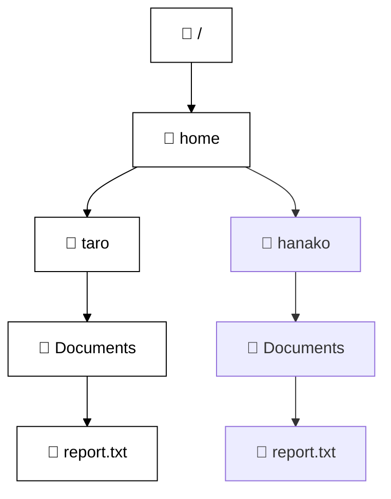

# UNIXファイルシステムと基本コマンド練習教材

この教材では、UNIXのファイルシステム構造をMermaidで視覚化しながら、基本的なコマンド（pwd, cd, mkdir, rm など）を学習します。

## 📁 ファイルシステム構造（Mermaid）



## 🧪 基本コマンドの使い方

### pwd
```bash
pwd
# => /home/taro/Documents
```

### cd
```bash
cd /home/taro/Downloads
```

### mkdir
```bash
mkdir /home/taro/music
```

### rmdir
```bash
rmdir /home/taro/music
```

### cp
```bash
cp /home/taro/Documents/report.txt /home/taro/Downloads/
```

### mv
```bash
mv /home/taro/Documents/report.txt /home/taro/Documents/report_backup.txt
```

### rm
```bash
rm /home/taro/Downloads/image.png
```

---

## 📚 補足

この教材はGitHub上でMermaid記法を表示することができます。ローカルで開く際はMermaid対応のMarkdownビューアをご利用ください。
