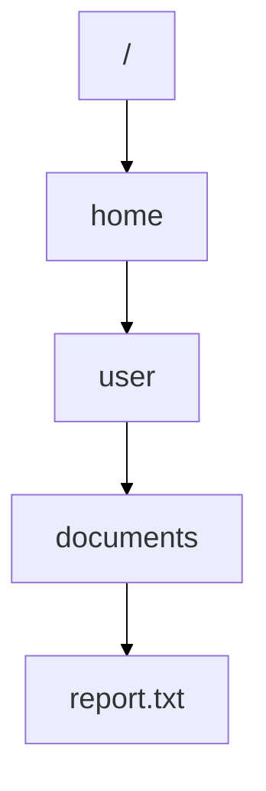

```mermaid
%%{init: {
  'theme': 'default',
  'themeVariables': {
    'primaryColor': '#000000',
    'primaryTextColor': '#000000',
    'primaryBorderColor': '#000000',
    'lineColor': '#000000',
    'backgroundColor': '#ffffff',
    'fontSize': '20px'
  }
}}%%

graph TD
  A["/"] --> B["home"]
  B --> C["user"]
  C --> D["documents"]
  D --> E["report.txt"]
```
